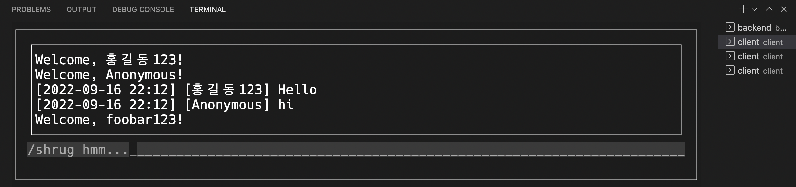

<div align="center">
    
</div>

# [Backend (Server)](./backend)

```console
$ cd backend
$ cargo run
```

## TODO

-   [x] Thread pool (with [`threadpool`](https://crates.io/crates/threadpool) crate)
-   [ ] Database
-   [ ] ~~User permissions~~ (project topic changed to anonymous chat)
-   [ ] Commands (e.g. `/say` ..)

# [Client](./client)

```console
$ cd client

Use cursive crates. if you get errors when building, see the cursive repository.
https://github.com/gyscos/cursive
$ cargo run
```

# Commands

| Command  | Description                 |
| -------- | --------------------------- |
| `/say`   | Send a message anonymously. |
| `/shrug` | Send a message with a shrug |

it is handled by the backend.
